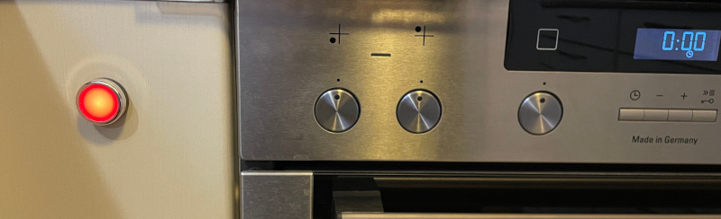
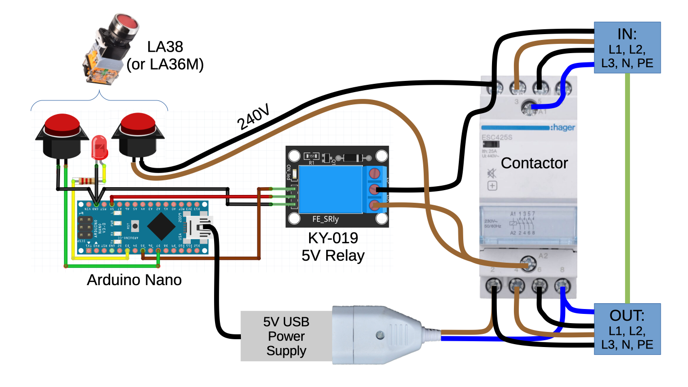
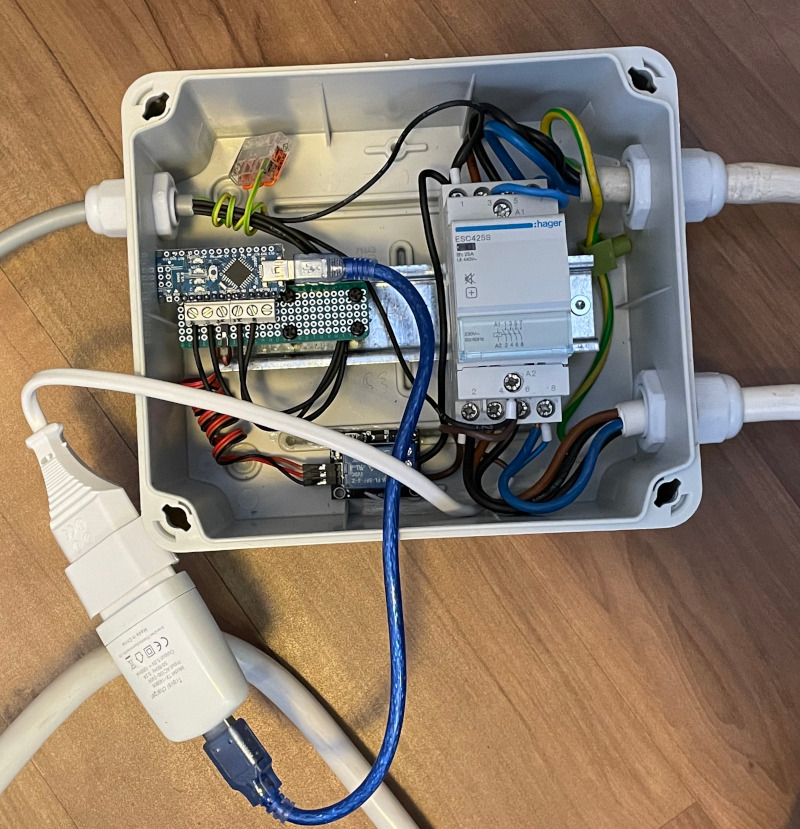

`oven-safety-timer`
==================

This is an Arduino-Nano-based **safety timer** for an electric oven, written in [`Rust`]. 



By pressing the red button, you can switch it on, and it will turn itself off again after 10 minutes, hopefully preventing a fire if you forget to switch the oven off yourself. 

Two minutes before it will switch off, it warns you by flashing an LED in the push button. You can always press the button again to keep it running for another 10 minutes, or long-press to turn off early.

The large currents for the oven are switched via a contactor, which in turn is switched by an Arduino-compatible relay. 
To avoid any standby power consumption, the entire system is completely switched off most of the time; so we need a 240V-compatible button switch that can initially power the contactor. 

A USB power supply is connected to the output of the contactor and powers the Arduino, and when the Arduino is running, it immediately turns on its relay, to keep everything alive. 

The button switch also needs an isolated second set of contacts, to interface with the Arduino at 5V. An LA38 (or LA36M) modular switch provides this. These switches can also be fitted with an LED module, but those do not normally light up at 5V, so you need to change the resistor value. This is fairly easy with the LA38, as the modules can be easily disassembled.

The Arduino code is written in [`Rust`], and uses [`Rahix`]'s [`avr-hal`].

[`Rahix`]: https://blog.rahix.de/
[`Rust`]: https://www.rust-lang.org/
[`avr-hal`]: https://github.com/Rahix/avr-hal/

# Building

Follow the instructions in [`avr-hal`] or a tutorial like https://blog.logrocket.com/complete-guide-running-rust-arduino/ to set up the tool chain.

Clone the repository:
```
git clone https://github.com/mh-/oven-safety-timer.git
cd oven-safety-timer
```
Build:
```
cargo build
```
Build and install on the Arduino:
```
cargo build
```


#
# WARNING

DO NOT BUILD OR INSTALL THIS TYPE OF HARDWARE, UNLESS YOU ARE A QUALIFIED ELECTRICIAN AND KNOW EXACTLY WHAT YOU ARE DOING! 
THE HIGH VOLTAGES (400V) ARE EXTREMELY DANGEROUS, AND THE CURRENTS INVOLVED CAN EASILY CAUSE OVERHEATING AND SET YOUR HOUSE ON FIRE!
#

## Hardware

### Schematic:



### Example build:




## License
Licensed under either of

 - Apache License, Version 2.0
   ([LICENSE-APACHE](LICENSE-APACHE) or <http://www.apache.org/licenses/LICENSE-2.0>)
 - MIT license
   ([LICENSE-MIT](LICENSE-MIT) or <http://opensource.org/licenses/MIT>)

at your option.

## Contribution
Unless you explicitly state otherwise, any contribution intentionally submitted
for inclusion in the work by you, as defined in the Apache-2.0 license, shall
be dual licensed as above, without any additional terms or conditions.
